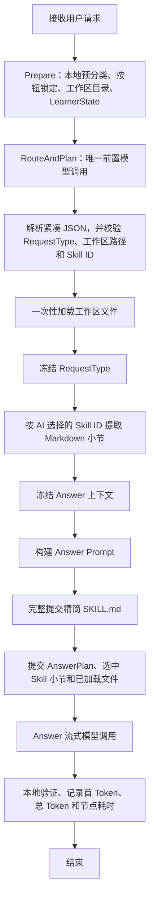

# ClassMate RouteAndPlan 优化流程

> 日期：2026-07-27
> 状态：当前实现
> 目标：减少前置模型调用、重复上下文和等待时间，同时保留完整 `SKILL.md` 与最终回答流式输出。

## 核心变化

1. Router 与 Planner 合并为一次 `RouteAndPlan` 模型调用。
2. 取消“加载上下文后再次 Router”的模型循环。
3. `SKILL.md` 精简为核心规则，规划和最终回答阶段都完整提交。
4. 规划模型获得由 `skill-graph.json` 动态生成的完整紧凑 Skill 目录，但不获得 Skill 正文和图关系。
5. 规划模型选择稳定 Skill ID；运行时验证 ID 后提取对应 Markdown 小节。
6. 规划阶段只获得用户问题和压缩工作区目录，不获得活动文件、题目或 Skill 正文。
7. 最终 Answer 强制使用流式接口，前端逐块显示。
8. RouteAndPlan 使用紧凑 JSON 字段，并在 DeepSeek 上关闭思考模式；可选字段由本地补默认值，降低规划耗时和 JSON 失败率。
9. 明确要求“第一层提示”时，本地锁定为 `problem_hint`，最终回答限制长度与代码行数，防止模型越级给出完整答案。

## 当前流程

## RouteAndPlan 输入

- 完整精简版 `SKILL.md`。
- 完整紧凑 Skill 目录：`id`、标题、Markdown 路径、标题路径、关键词和用途。
- 用户当前问题。
- 请求来源、按钮 ID 和本地预分类锁。
- LearnerState。
- 最多 200 个工作区目录项，每项只有相对路径、类型和大小。

禁止提交活动文件预览、`question.md` 正文、Skill 正文、完整 `skill-graph.json` 和完整历史对话。

## RouteAndPlan 输出

- 使用短字段紧凑传输：`t`（任务类型）、`f`（文件）、`s`（Skill ID）、`d`（回答深度）、`p`（步骤）、`i`（必须包含）、`a`（禁止包含）、`code`（是否允许完整代码）、`q`（是否需要题目）、`u`（置信度）。
- 最多选择 5 个工作区文件和 5 个 Skill 节点。
- 缺少可选字段时由程序填入安全默认值，不会因为 `null` 或次要字段缺失丢弃整份规划。
- 模型返回数组过长时由程序截断，不让一次格式偏差导致整次规划失败。

模型返回的路径和 ID 必须存在于输入目录。无效项由运行时丢弃并记录，不会尝试读取。

## Answer 输入

- 完整精简版 `SKILL.md`。
- `references/pedagogy.md`。
- 冻结的 AnswerPlan。
- 选中的 Skill 小节正文。
- 一次性加载的工作区文件。
- `CLASSMATE.md` 中允许的偏好。
- 最近最多 8 条对话，每条最多 4,000 字符。

活动文件预览和题目正文只有被规划或确定性规则选中并加载后才会提交，避免重复。

## 调用次数

| 场景 | 模型调用 |
|---|---:|
| 普通回答 | RouteAndPlan 1 次 + Answer 1 次 |
| 规划 JSON 失败 | 本地 fallback + Answer 1 次 |
| Skill 检索失败 | 不增加调用，降级 Answer |
| 工作区加载失败 | 不重新规划，降级 Answer |
| Answer 非流式测试且校验失败 | 最多重试 1 次 |
| 正常 VS Code 流式回答 | 不在流式内容后自动重试，避免重复显示 |

## 流式输出与性能记录

- `RouteAndPlan` 使用非流式 JSON 调用，避免把不完整 JSON 暴露给解析器。
- `Answer` 只要收到 `onToken` 回调就强制走适配器的流式接口。
- 每个回答片段立即发送给 Webview；完成事件只收尾，不再次追加完整答案，因此不会重复显示。
- 性能日志分别记录 `route_and_plan`、工作区加载、Skill 检索、Prompt 构建、Answer、首个回答片段和总耗时。
- Token 统计累加 RouteAndPlan 与 Answer，而不是只显示最后一次调用。
- 第一层提示默认关闭 DeepSeek 思考模式并限制输出预算，减少等待和越级回答。

## 安全边界

- 工作区路径必须精确存在于目录。
- Skill ID 必须存在于已验证的 Skill Graph。
- Skill 来源只允许 `references/*.md`。
- 明确点名的工作区文件由程序确定性加载。
- 代码错误类任务确定性加载活动源文件。
- 题意和提示类任务确定性加载题目文件。
- Skill Graph 失效时不能加载全部参考文件兜底。
- 最终回答不得声称未加载的代码真实存在。
