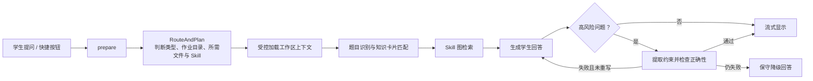

# ClassMate 项目交接文档

> 更新日期：2026-08-03  
> 当前工作目录：`F:\智理杯\ClassMate\ClassMate-V5-20260728`  
> 基线版本：`0.0.5`，分支：`feature/classmate-v0.0.5`  
> 当前状态：V5 的作业上下文、知识卡片与界面改造已完成；回答正确性管线已接入但尚未达到稳定发布标准。

## 1. 给接手者的结论

当前优先级如下：

1. 报错分析链路完善；
2. 将已有 Debug Journey 升级为真正可复习的错题本；
3. 完成回归、VSIX 打包和 PR 发布。

## 2. 当前系统流程

主要实现入口：

- `src/graph/ClassMateGraphRunner.ts`：LangGraph 工作流、上下文冻结、知识卡片、正确性检查与重写；
- `src/workspace/`：工作区扫描、题面选择、相关文件范围和安全限制；
- `src/problemKnowledge/`：数据结构具体题目知识卡片匹配；
- `skill/classmate/`：教学 Skill、Skill Graph 和数据结构知识；
- `src/error/`、`src/compiler/`：编译、报错解析和错误知识库；
- `src/debug/`：Debug Journey 与 Markdown 错题本导出；
- `webview/src/App.tsx`：聊天页面、快捷提问、阶段状态与上下文展示。

## 3. 已完成的演进（从 LangGraph 到现在）

### 3.1 LangGraph 前的基础能力

早期版本已经具备以下基础：聊天问答、选中代码解释、C++ 编译与运行、编译输出展示、报错文本解析、错误知识库、Debug Journey、调用历史统计、错题本 Markdown 导出、多模型配置。

这部分的核心价值是：插件不只回答问题，也能记录“编译失败 → 求助 → 修改 → 再编译”的学习过程。

### 3.2 V4：引入 LangGraph 的受控回答流程

V4 的核心改动是从单次自由问答改成 `RouteAndPlan → Load Context → Answer`：

- 一次模型调用决定任务类型、需要的文件和 Skill；
- 控制器校验模型返回的路径与 Skill ID，避免目录穿越和模型编造文件；
- 回答阶段只接收冻结后的上下文；
- 支持代码修改提案、用户确认和文件冲突检查；
- 保留回答流式输出，并显示首 Token 前的运行阶段；
- 支持 Makefile、`GNUmakefile` 与 `.mk` 作为可读取工作区文件；
- 记录节点耗时和 Token 消耗。

对应文档：`CHANGELOG.md` 的 `0.0.4`、`src/graph/ClassMateGraphRunner.ts`。

### 3.3 V5：解决“明明有题目/代码却没有读到”的问题

V5 重点改造上下文加载和题目识别：

- 区分问题语义类型与文件加载范围（`ContextMode`）；
- 对作业、题目、活动源代码目录提高加载优先级；
- 支持 `question/problem/问题/题目/作业说明/assignment` 等题面文件名；
- 对小型题目目录可加载全部相关文件，不再固定最多 5 个文件；
- 持久化同一会话的题目根目录与上下文，支持自然追问；
- 加入受控的数据结构题目知识卡片、Zuma 故障子卡与事实库；
- 重新设计聊天界面：快捷提问、多行输入、停止按钮、等待阶段、读取文件展示、复制与回到最新。

已有成效：此前 OOP 真实测试中，零文件回答由 9 次降到 0 次；Zuma 精确故障卡测试由大量跑偏改善为大多数可正确定位。

对应文档：`MVP进展.V5.md`、`docs/architecture-v5.md`、`docs/problem-knowledge-v5.md`。

### 3.4 2026-08-01：回答正确性管线（尚未稳定）

已新增：

- 高风险题的约束提取节点；
- 轻量正确性检查节点，覆盖算法适用性、复杂度、算术、反例、题目条件、代码接口与完整答案一致性；
- 高风险回答先缓存，检查通过后再显示；
- 最多一次重写；
- 正确性回归历史与真实 API 回归测试集。

但它仍处于“可验证原型”阶段，不能视为已完成，具体缺口见第 6 节。

## 4. 已存在但仍需完善的能力

| 能力 | 目前已经有的内容 | 仍缺少的内容 |
|---|---|---|
| 错题本 | Debug Journey、编译/求助/修改事件、Markdown 导出 | 自动归并同一题、错误去重、学生复习计划、重新练习入口、质量评估 |
| 报错分析 | g++ 编译/运行、stderr 解析、错误知识库、选中错误解释 | 运行时/OJ 错误的结构化采集、Makefile 实际构建、可复现测试、更多语言/编译器支持 |
| 回答稳定性 | RouteAndPlan、上下文白名单、Skill 图、知识卡、一次正确性检查与重写 | 高风险覆盖率、专用验证规则、二次重写验证、上下文体积控制 |
| 工作区读取 | 题目根目录选择、相关文件加载、Makefile 读取、文件安全限制 | 大课程目录切片、加载理由展示、超大课件精确章节召回 |
| UI | 快捷提问、多行输入、停止、阶段提示、已读取文件展示 | 实际读取内容/原因的更细解释、错误修复方案的应用反馈、可访问性与真实用户测试 |

## 5. 待完成任务 A：错题本

### 当前状态

已有“Debug Journey 导出 Markdown 错题本”功能，相关入口在 `src/extension.ts`、`src/debug/` 和 `README.md` 的“导出错题本”。它主要记录调试事件，**还不是一个面向学生长期复习的错题本产品**。

### 建议实现内容

1. **题目级聚合**：按题目目录、题目文件哈希、用户手动名称或 OJ 题号归并事件，避免一次题目产生多条零散记录。
2. **错误卡片结构化**：每张卡至少包含题目、错误现象、根因、正确思路、用户曾经的代码片段、最终是否解决、相关知识点。
3. **去重与版本链**：同一错误反复编译失败时合并为一次学习事件；保留“第一次出现 → 用户修改 → 是否解决”的时间线。
4. **复习模式**：支持按“未解决、重复出现、最近出现、某知识点”筛选；可生成简短复习题或让学生重新解释错误原因。
5. **隐私与可控导出**：默认仅保存在本地；导出前让用户选择是否包含代码全文、文件路径和模型回答。
6. **验收标准**：同一题连续三次编译报同类错误，只生成一张卡并显示解决过程；用户可以筛选“未解决的指针错误”。

### 推荐文件

- `src/debug/debugJourneyStore.ts`
- `src/debug/debugNotebook.ts`
- `src/ui/DebugJourneyTreeProvider.ts`
- `src/extension.ts`
- `webview/`（若新增错题本浏览页面）

## 6. 待完成任务 B：报错分析

### 当前状态

已有 C++ `g++` 编译、运行、编译输出虚拟文档、报错解析、错误知识库和选中错误解释。页面快捷入口已从“为什么会超时”改为“为什么会报错”，但其内部提示文本仍偏向超时分析，后续需要统一语义。

### 建议实现内容

1. **区分报错类型**：编译错误、链接错误、运行时崩溃、超时、错误输出、OJ 反馈分别进入不同模板与检查流程。
2. **实际构建方式**：当前可以读取 Makefile，但不等于会执行 Makefile。为项目型作业增加“检测并选择 g++/Makefile/CMake”的明确构建策略，并要求用户确认命令。
3. **运行时诊断**：支持保存 stdin、stdout、stderr、退出码、耗时；条件允许时提供 AddressSanitizer/UndefinedBehaviorSanitizer 的可选诊断。
4. **最小复现**：模型提出测试数据后，由控制器先检查输入格式，再显示；避免编造无法执行的复现样例。
5. **错误知识库扩充**：把历史 OJ 错误和知识卡片中的已验证事实转为可检索的错误模式，但必须标注适用条件。
6. **验收标准**：对编译错误、RE、TLE、WA 各准备至少 10 个固定案例；系统能明确说明“证据不足，无法断定 WA/TLE/RE”而不乱猜。

