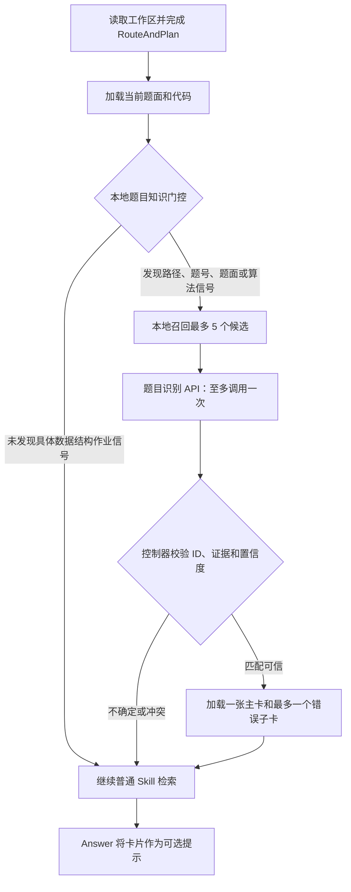

# ClassMate V5：数据结构题目知识卡片

## 目标

为已经拥有参考答案的数据结构作业提供按需知识提示。卡片保存主要方法、复杂度、易卡点和调试线索，但不能覆盖当前题面或代码，也不能绕过分层提示规则。

## 卡片范围

- PA1：filename、Interview-old、Gift、Graphics、二维偏序。
- PA2：Risk、Polynomial、Sect。
- PA3：Dance、Kidd、Nearest Neighbor。
- PA4：Game、Pattern Matching、Component、Sort。
- LAB2 Zuma：一张基础卡和代码 01 至 10 的错误子卡。

参考答案中的编号不一致、文字笔误和未经证明的复杂度不会原样写入卡片；卡片中保留必要的复核提醒。

## 流程

多轮对话在题目指纹未变化时复用上一次结果，不重复调用识别 API。用户明确换题、题目目录改变、活动文件改变或对话点名另一张卡时重新识别。

## 本地门控

门控只决定是否值得识别，不能直接认定题目。信号包括：

- 路径中的 `数据结构`、`CST`、`PA1` 至 `PA4`、`LAB`、题号或 OJ ID；
- 题面中的单调队列、Splay、KD 树、并查集、左式堆、Dijkstra、二维哈希、Zuma 等特征；
- 用户直接粘贴的题号、标题和特殊题面语句。

普通闲聊、一般概念问题和无具体题目信号的其他课程不会调用识别 API。

## 候选和识别

`problem-card-index.json` 保存：

- 稳定卡片 ID；
- 课程、PA/LAB 编号、OJ ID、标题和别名；
- 路径关键词、特殊题面短句、概念和代码标记；
- 已知错误程序的精确内容哈希；
- Markdown 正文位置。

本地检索先按这些证据召回最多 5 个候选。识别 API 只收到候选元数据和受限工作区证据，不收到卡片正文或参考答案代码，并只能从候选 ID 中选择。

控制器采用以下最低要求：

- 高置信度：模型置信度至少 0.82，且有本地证据；
- 中置信度：模型置信度至少 0.65、本地分数至少 0.28，并具有至少两类独立证据；
- 最高两个候选过于接近且没有题号、标题或内容哈希等强证据时拒绝加载。

## Answer 安全边界

- 卡片是可能来自相近题目版本的可选提示。
- 当前工作区题面和代码始终优先。
- 调试时必须在当前代码中找到真实语句后，才能采用错误子卡。
- 只加载一张主卡和一个同题子卡，不加载整个题库。
- 卡片读取或识别失败时继续使用原工作区和普通 Skill。
- 继续遵守当前提示层级，卡片不会自动授权完整答案。

## 主要实现文件

- `src/problemKnowledge/problemKnowledgeGate.ts`：本地门控。
- `src/problemKnowledge/problemEvidenceBuilder.ts`：构造受限识别证据和题目指纹。
- `src/problemKnowledge/problemCandidateRetriever.ts`：本地候选评分。
- `src/prompts/problemIdentifierPromptBuilder.ts`：单次识别 API 提示。
- `src/problemKnowledge/problemCardIndexLoader.ts`：索引校验。
- `src/problemKnowledge/problemCardExtractor.ts`：按标题抽取选中卡片。
- `src/graph/ClassMateGraphRunner.ts`：识别、复用和降级流程。
- `src/prompts/answerPromptBuilder.ts`：将卡片标记为可选参考。
- `skill/classmate/graph/problem-card-index.json`：题目标识目录。
- `skill/classmate/references/data-structure-*-cards.md`：知识卡片正文。

## 三层知识卡片结构

知识卡片现在不再把“如何匹配、哪些事实、怎样讲解”混在一个 Markdown 文件中，而是分成三层：

1. `problem-card-index.json`：只负责匹配。保存题号、标题、别名、特殊语句、代码标记、内容哈希和 Markdown 位置。
2. `problem-card-facts.json`：只保存机器可校验的事实。每个题目或故障变体包含主结论、证据、复杂度、易错点、已验证样例、已排除说法和回答要求。
3. `data-structure-*-cards.md`：只负责教学表达。保存适合初学者阅读的思路、解释顺序和调试提示。

控制器会验证事实文件中的 ID 与匹配索引一一对应。匹配成功后，每轮最多加载一份基础事实和一份故障变体事实，不会把整个事实库提交给 Answer。

### 结构化事实字段

- `id`：必须与题目索引中的题目或变体 ID 完全相同。
- `kind`：`solution` 表示解题方法，`diagnostic` 表示具体故障诊断。
- `primaryConclusion`：回答最核心、最稳定的结论。
- `evidence`：支持结论的题意、代码或算法依据。
- `complexity`：可选的时间复杂度和空间复杂度。
- `pitfalls`：容易卡住或写错的位置。
- `verifiedTests`：已经人工核对输入、操作数和期望输出的样例。
- `rejectedClaims`：已排除或容易误判的说法。
- `answerRequirements`：该卡片被采用时，回答必须满足的表达要求。

精确代码哈希命中时，结构化主结论会进入冻结的 `AnswerPlan.mustInclude`，并以温度 0 生成；普通题名或题面匹配时，事实和教学卡片都只是可选提示，仍必须以当前工作区为准。
